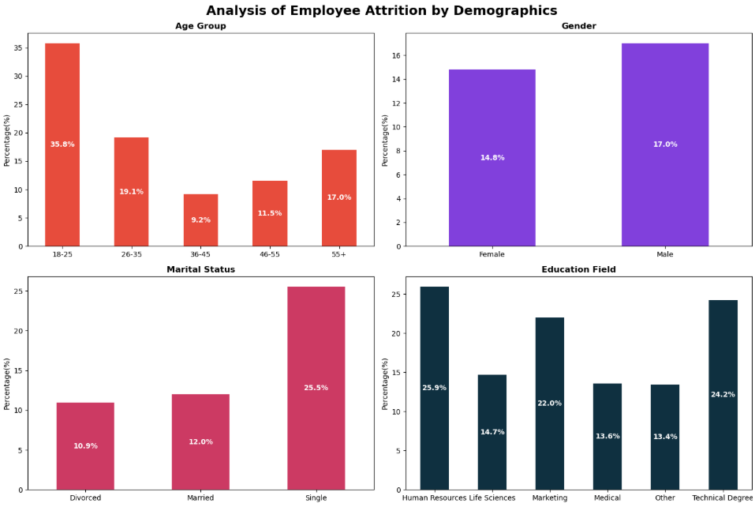
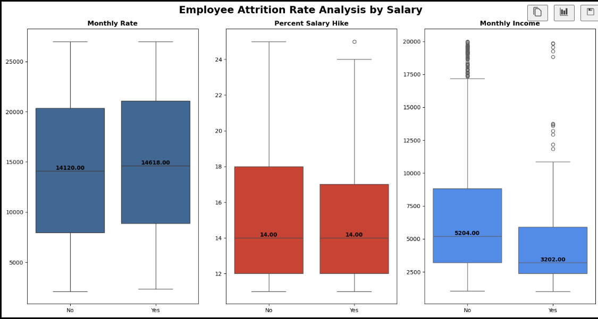
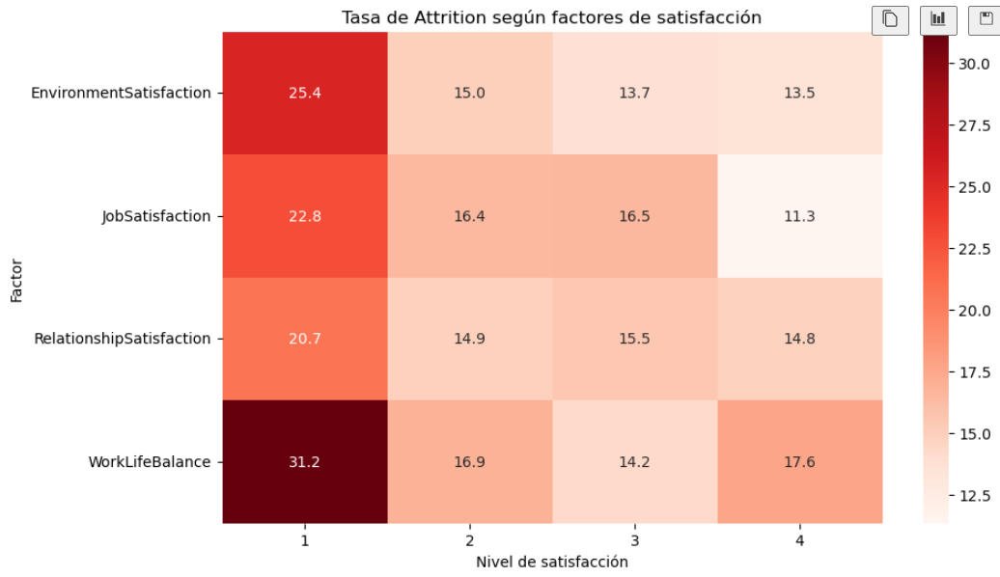
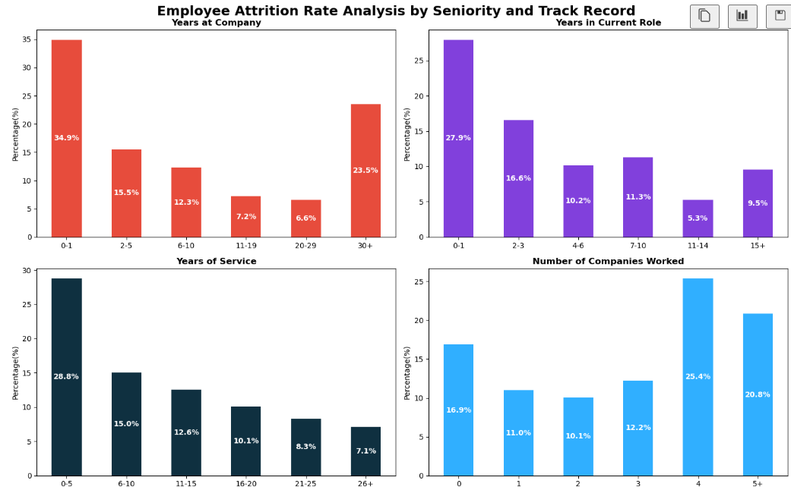
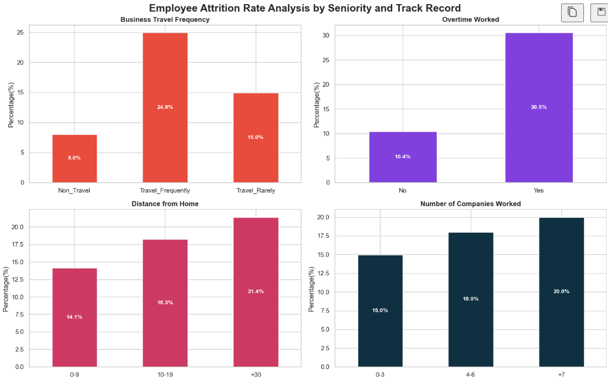
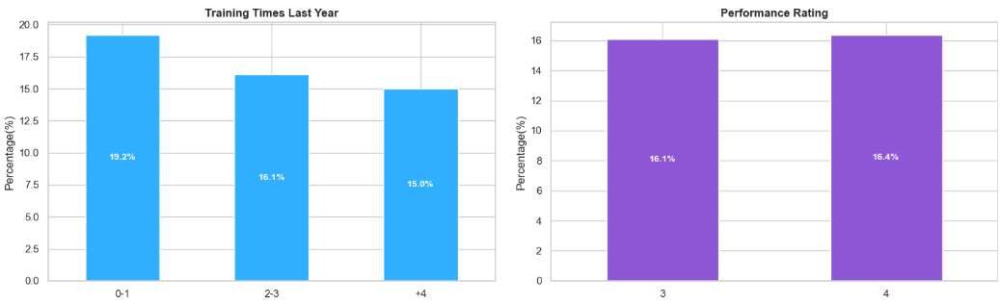
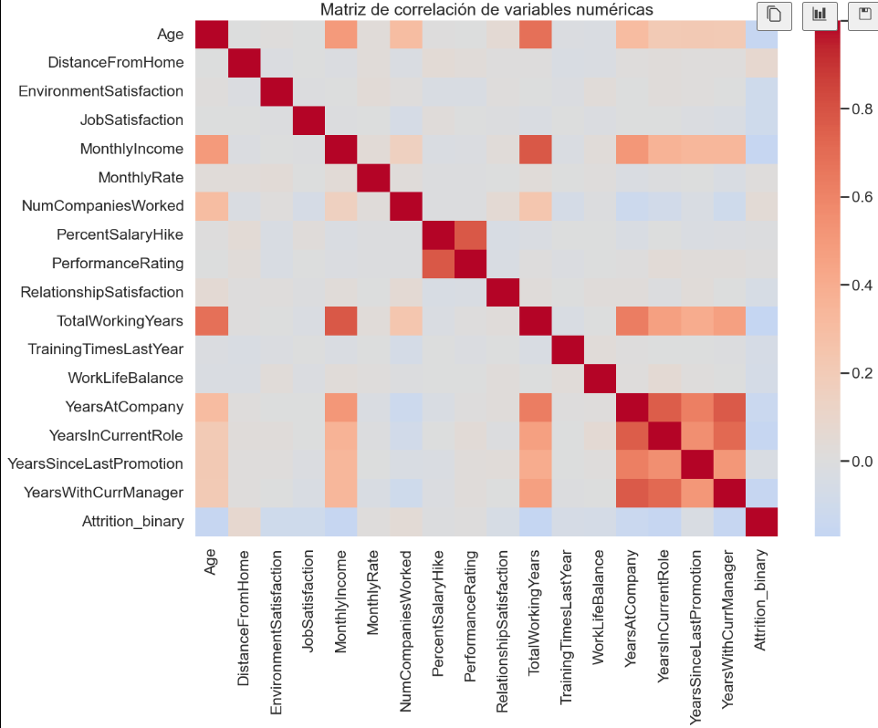
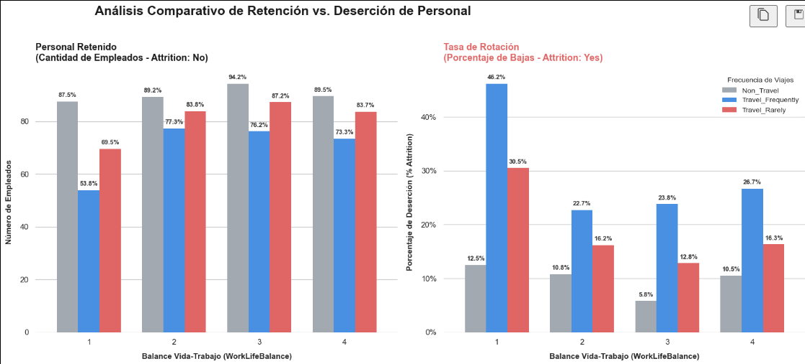

# 
**Análisis de rotación de personal**

## Acerca del conjunto de datos
Este proyecto analiza a fondo los datos de recursos humanos de la compañía para identificar las causas principales de la rotación de personal. A través de un estudio que va desde el análisis de variables individuales hasta la conexión de distintas categorías, el trabajo descubre los patrones y tendencias que motivan la salida de los empleados. Finalmente, el análisis aporta datos clave para diseñar estrategias prácticas que mejoren el clima laboral y aumenten la retención del talento.

## Características principales
* **Procesamiento de Datos**: Uso de **Pandas** para la limpieza, transformación y estructuración del dataset.
* **Análisis Visual**: Creación de gráficos estadísticos con **Matplotlib** y **Seaborn** para explorar variables clave.
* **Panel Interactivo**: Diseño de un dashboard en **Power BI** para visualizar los indicadores de forma clara y práctica.

## Descripción general del conjunto de datos

El estudio organiza las métricas del personal en categorías específicas antes de conectarlas entre sí:
* **Compensación**: Evaluación de salarios e incentivos económicos.
* **Ambiente Laboral**: Medición del clima organizacional y la satisfacción interna.
* **Trayectoria Profesional**: Análisis de ascensos, antigüedad y crecimiento.
* **Factores Laborales**: Revisión de horarios, cargas de trabajo y roles.
* **Análisis Multivariable**: Cruce avanzado de datos para encontrar correlaciones ocultas entre las variables.

## Columnas clave del conjunto de datos
**'EmpID'**:  Identificación por empleado 
**'Age'**:  Edad del empleado. 
**'Attrition'**:  Sí el empleado dejó la organización (si/no). 
**'BusinessTravel'**:  Clasificación por frecuencia de viaje. 
**'Department'**:  Departamento al que pertenece el empleado. 
**'DistanceFromHome'**:  Distancia de la casa al trabjo del empleado. 
**'EducationField'**:  Campo de educación del empleado. 
**'EnvironmentSatisfaction'**:  Clasificación numérica de la satisfacción del empleado sobre el ambiente. 
**'Gender'**:  Genero sexual del empleado. 
**'JobRole'**:  Rol desempeñado dentro de la organización. 
**'JobSatisfaction'**:  Clasificación númerica de satisfacción sobre el trabajo. 
**'MaritalStatus'**:Estado civil del empleado. 
**'MonthlyIncome'**:  Es el salario bruto real que el empleado recibe fijado en su contrato.  
**'MonthlyRate'**: Es un valor operativo o financiero interno de la empresa. 
**'NumCompaniesWorked'**: Numero de compañia en las que ha trabajado el empleado previamente. 
**'OverTime'**: Cladificación si hace o no tiempo extra.(si/no)  
**'PercentSalaryHike'**: Porcentaje de aumento salarial. 
**'PerformanceRating'**: Clasificación numérica del desempeño del empleado. 
**'RelationshipSatisfaction'**:Clasificación númerica respecto a la relación con con compañeros. 
**'TotalWorkingYears'**: Número de años trabajados durante su trayectoria laboral. 
**'TrainingTimesLastYear'**: Timepo de capacitación en horas el año pasado. 
**'WorkLifeBalance'**: Clasificación numérica del balance vida-trabajo. 
**'YearsAtCompany'**: Antiguedad en años en la compañia. 
**'YearsInCurrentRole'**: Antiguedad en años en el rol actual. 
**'YearsSinceLastPromotion'**: Años trascurridos desde la última promoción. 
**'YearsWithCurrManager'**: Años trabajando con el actual gerente. 

## Objetivos y preguntas de negocio

* ¿Qué perfiles presentan mayor riesgo de rotación?
* ¿Qué factores laborales están asociados con mayor Attrition?

* ¿La compensación está relacionada con la permanencia?

* ¿Existen combinaciones de factores que incrementan especialmente la rotación?

* ¿Qué acciones podría tomar RR. HH.?

## **¿Cúal es la proporción de empleados que dejan la empresa?**

## **Análisis Según sus Características Demográficas:**

  

1. **Edad (Age Group)**

**Punto clave:** La rotación es mucho más alta en los empleados más jóvenes.

**Detalle:** El grupo de 18-25 años tiene el porcentaje de abandono más alto con un 35.8%. En cuanto a Attrition por edad, se encuentra que los empleados entre 26 y 35 años presentan mayor cantidad de individuos que desertan de la empresa

**Tendencia**: Conforme aumenta la edad, la rotación baja notablemente (el punto más estable es de los 36-45 años con solo 9.2%), pero vuelve a subir ligeramente en los mayores de 55 años (17.0%).

2. **Estado Civil (Marital Status)**

**Punto clave:** Los empleados solteros son los que más se van.

**Detalle:** El grupo de personas solteras (Single) registra una rotación del 25.5%.

**Comparación:** Esto es más del doble en comparación con los empleados divorciados (10.9%) y casados (12.0%), quienes muestran mayor estabilidad laboral.

3. **Campo de Estudio (Education Field)**

**Punto clave:** Las áreas de Recursos Humanos y Carreras Técnicas sufren la mayor pérdida de personal.

**Detalle:** Human Resources lidera la rotación con un 25.9%, seguida muy de cerca por Technical Degree con un 24.2% y Marketing con un 22.0%.

**Estabilidad:** Los campos vinculados a Ciencias de la Vida (Life Sciences), Medicina (Medical) y Otros (Other) se mantienen más estables, rondando entre el 13% y 15%.

4. **Género (Gender)**

**Punto clave:** La diferencia entre hombres y mujeres es muy pequeña.

**Detalle**: Los hombres (Male) tienen un porcentaje de abandono del 17.0%, mientras que las mujeres (Female) tienen un 14.8%. Hay una ligera tendencia de mayor rotación en el género masculino, pero no es tan drástica como en la edad o el estado civil.

**Conclución:** Consinderando los resultados del analisis de estas 4 variables podemos proponer un primer perfil con mayor riesgo de dejar la empresa: Un empleado joven (18-35 años), soltero, y que trabaja o estudió en el área de Recursos Humanos o una Carrera Técnica.

## **Análisis Basado en Compensación:**

  

1. **Análisis de Monthly Rate (Costo Total Mensual)**

**Descripción visual:** La distribución del costo total mensual muestra una gran similitud entre ambos grupos de empleados.

**Hallazgo clave:** Existe un ligero incremento en la mediana del grupo que abandonó la empresa ("Yes", 14,618 unidades) en comparación con el grupo que permaneció ("No", 14,120 unidades).

**Conclusión:** Esta diferencia de 458 unidades sugiere que los empleados que se van representan un costo ligeramente superior. Sin embargo, la amplia superposición de los rangos intercuartílicos y de los bigotes demuestra que el costo mensual por sí solo no parece ser un factor determinante para la rotación laboral.

2. **Análisis de Percent Salary Hike (Porcentaje de Aumento Salarial)**

**Descripción visual:** Ambas distribuciones comparten exactamente la misma línea central.

**Hallazgo clave:** La mediana del porcentaje de aumento salarial es idéntica en ambos grupos, situándose en 14.0%.

**Conclusión:** A pesar de compartir el mismo valor central, el grupo que permanece en la empresa ("No") muestra una dispersión ligeramente mayor en la parte superior de la caja (Q3). Esto indica que un sector de los empleados que se quedan logra alcanzar aumentos salariales más altos en el rango del 18% al 25%, a diferencia de quienes se van, cuya distribución se concentra más hacia valores inferiores.

3. **Análisis de Monthly Income (Ingresos Mensuales)**

**Hallazgo clave:** Existe una brecha económica muy marcada. La mediana de ingresos de quienes se quedan ("No") es de 5,204 unidades, mientras que la de quienes abandonan ("Yes") cae drásticamente a 3,202 unidades.

**Conclusión:** El ingreso mensual es una variable crítica para la rotación. Los empleados que dejan la empresa perciben ingresos notablemente menores. Además, el gráfico del grupo "Yes" se comprime hacia abajo, lo que revela que la gran mayoría de las bajas ocurren en los rangos salariales más desfavorecidos. Los outliers, muestran que son muy pocos los empleados con sueldos altos que deciden renunciar.

**En Resumen:** El análisis financiero de la rotación revela que el problema no radica en lo que el empleado le cuesta a la organización (Monthly Rate), ni en el porcentaje de sus aumentos (Percent Salary Hike), sino en el salario neto percibido (Monthly Income). La fuga de talento se concentra con fuerza en el personal que cuenta con los ingresos mensuales más bajos de la compañía.

## **Análisis Basado en Satisfacción y Ambiente Laboral:**

  

El mapa de calor demuestra una relación inversamente proporcional muy clara: a menor nivel de satisfacción o balance, mayor es la tasa de deserción laboral (Attrition).

Los hallazgos más críticos del análisis se detallan a continuación: 

1. **La crisis del Nivel 1 (Baja Satisfacción)**: Cuando los empleados evalúan cualquier factor en el nivel más bajo (1), la fuga de talento se dispara de forma alarmante en comparación con los niveles superiores.

2. **El Balance Vida-Trabajo como detonante principal:** El factor más crítico para la retación es WorkLifeBalance. Los empleados que perciben un mal balance entre su vida personal y laboral presentan la tasa de abandono más alta de todo el estudio, alcanzando un 31.2%.

3. **El impacto del Entorno y el Puesto:** La insatisfacción con el ambiente de trabajo (EnvironmentSatisfaction) y con el puesto actual (JobSatisfaction) son el segundo y tercer disparador de bajas, registrando tasas del 25.4% y 22.8% respectivamente en su nivel mínimo.

4. **El efecto de las Relaciones Laborales:** Una mala relación con los compañeros o jefes (RelationshipSatisfaction) también impulsa la salida del personal con un 20.7%. Aunque es el porcentaje más bajo dentro del Nivel 1, sigue duplicando la tasa de deserción de los niveles de alta satisfacción.

5. **Estabilización en niveles 2, 3 y 4:** Una vez que el empleado supera la barrera del nivel 1, la tasa de deserción disminuye drásticamente, estabilizándose en la mayoría de los casos por debajo del 17%. El punto de mayor retención se logra en el nivel 4 de JobSatisfaction, donde la deserción cae a su punto mínimo con apenas un 11.3%.

**Conclusión:** La organización debe priorizar acciones inmediatas sobre los empleados que evalúan sus factores con puntuación de 1, poniendo especial foco en las políticas de flexibilidad laboral y balance de vida (WorkLifeBalance). Resolver la insatisfacción crítica es la estrategia con mayor potencial para reducir el índice global de rotación.

## **Análisis Basado en Antiguedad y Trayectoria Laboral**

  

1. **Años de Antigüedad en la Compañía (Years at Company)**

**Punto crítico inicial:** Los empleados en su primer año (0-1 años) registran la mayor deserción con un 34.9%.

**Comportamiento intermedio:** Se observa una tendencia decreciente constante a medida que aumenta la antigüedad, tocando su punto más bajo en el rango de 20-29 años (6.6%).

**Repunte final:** Existe un incremento crítico en el segmento de colaboradores con más de 30 años de trayectoria (23.5%).

2. **Permanencia en el Rol Actual (Years in Current Role)**

**Etapa de inducción:** El personal con menos de un año en su posición actual presenta la tasa más alta (27.9%).

**Fase de estancamiento:** Se identifica un segundo pico entre los 2 y 3 años (16.6%), seguido de un descenso.

**Curva de salida tardía**: Al superar los 15 años en el mismo puesto, la deserción vuelve a repuntar al 9.5%.
3. **Experiencia Total (Years of Service)**

**Tendencia lineal**: Existe una relación inversamente proporcional entre los años totales de servicio y la rotación.

**Concentración**: El grupo con menor experiencia laboral (0-5 años) lidera la salida con un 28.8%, cayendo gradualmente hasta un 7.1% en el personal senior (26+ años).

4. **Estabilidad Laboral Previa (Number of Companies Worked)**

**Perfil volátil:** Los empleados que han transitado por 4 o más de 5 empresas muestran los niveles más altos de deserción con 25.4% y 20.8% respectivamente.

**Talento junior:** Quienes ingresan a su primer empleo (0 compañías previas) representan el tercer grupo más vulnerable con un 16.9%.

🎯 **Perfil del Empleado con Mayor Riesgo de Rotación:** 

El análisis estadístico permite identificar dos perfiles de alto riesgo bien diferenciados:El Perfil "Junior" o Nuevas Contrataciones: Colaboradores en su primer año laboral, en su primer puesto dentro de la organización o con menos de 5 años de carrera total.

El Perfil "Rotador Crónico" (Job Hopper): Talento con un historial de más de 4 empleos anteriores, lo que correlaciona de forma directa con una baja retención interna.

🚀 **Recomendaciones Estratégicas (Análisis Enriquecido)**

Fortalecer el Onboarding (Inducción): Diseñar programas de acompañamiento crítico durante los primeros 12 meses para mitigar el 34.9% de deserción inicial.

Revisión de Líneas de Carrera (Hito de 2-3 años): Implementar evaluaciones de desarrollo y promociones a los 2 años en el rol para evitar la fuga por estancamiento (16.6%).

Plan de Retiro y Sucesión: Investigar las causas del repunte en empleados con más de 30 años en la empresa (23.5%) para determinar si se debe a jubilaciones o a la necesidad de planes de transferencia de conocimiento.

Filtros de Reclutamiento: Evaluar con mayor profundidad la motivación de candidatos que superen las 4 empresas previas en su historial.

## 🛠️💼⏳**Análisis Basado en Factores Laborales**

  

  

1. **Frecuencia de Viajes de Negocios (Business Travel Frequency)**

**Impacto por alta movilidad:** Los colaboradores con un esquema de viajes frecuentes registran la tasa de deserción más crítica, alcanzando un 24.9%.

**Movilidad moderada:** Aquellos que viajan de forma esporádica u ocasional muestran una rotación del 15.0%.

**Personal estático:** Quienes no requieren trasladarse por motivos de trabajo presentan el índice de salidas más bajo, con apenas un 8.0%.

**Insight:** Existe una relación directa entre el desgaste por traslados constantes y la renuncia. Viajar frecuentemente triplica el riesgo de deserción en comparación con el personal que trabaja fijo en su sede.

2. **Carga Laboral y Tiempo Extra (Overtime Worked)**

**Exposición al desgaste (Burnout)**: El personal que realiza horas extras de forma habitual presenta una alarmante tasa de rotación del 30.5%.

**Jornada estándar**: Por el contrario, los empleados que mantienen un horario regular sin sobretiempos registran solo un 10.4% de salidas.

**Insight**: El tiempo extra actúa como el catalizador de deserción más agresivo del estudio. Un empleado con sobrecarga laboral tiene prácticamente el triple de probabilidad (3x) de renunciar frente a quien respeta su jornada laboral regular.

3. **Logística de Traslado y Distancia (Distance from Home)**

**Proximidad (0-9 km)**: El talento que vive cerca de las instalaciones muestra la mayor estabilidad con un 14.1% de rotación.

**Distancia Media (10-19 km):** Al incrementarse el tiempo de traslado, la deserción sube significativamente al 18.3%.

**Distancia Crítica (+30 km):** Los colaboradores expuestos a largas distancias y tiempos de trayecto prolongados registran la tasa de abandono más alta, con un 21.4%.

**Insight:** El desgaste por transporte público o tráfico genera una tendencia de deserción lineal ascendente. A mayor distancia del centro de trabajo, mayor es la vulnerabilidad de la posición.

4. **Desarrollo Continuo y Capacitación (Training Times Last Year)** 

**Baja instrucción (0-1 horas)**: Los empleados con nula o mínima capacitación durante el último año fiscal lideran las salidas con un 19.2%.

**Instrucción intermedia (2-3 horas)**: Al brindar un nivel moderado de formación, el indicador disminuye al 16.1%.

**Instrucción continua (+4 horas)**: Los colaboradores con un plan de desarrollo más robusto logran la tasa de rotación más baja, situándose en un 15.0%.

**Insight:** La capacitación actúa como una herramienta efectiva de retención. Existe una tendencia decreciente en las salidas a medida que la empresa invierte más horas en el desarrollo profesional de su personal.

🚀 **Conclusiones y Plan de Acción Propuesto**

El análisis gráfico demuestra que el balance de vida, el desgaste operativo y el crecimiento profesional son las verdaderas palancas que mueven la rotación. Para mitigar estos riesgos, se sugieren las siguientes estrategias:

**Política de Horas Extra**: Auditar las áreas con mayor registro de tiempo extra (30.5% de riesgo) para balancear cargas de trabajo o contratar personal de apoyo.

**Flexibilidad Geográfica:** Implementar esquemas híbridos o de teletrabajo (Home Office) enfocados prioritariamente en el segmento que vive a más de 30 km para neutralizar el 21.4% de deserción en este nicho.

**Plan de Viáticos y Descanso**: Revisar los roles que exigen alta movilidad para asegurar periodos de recuperación adecuados tras viajes frecuentes.

**Plan Anual de Formación:** Asegurar que ningún colaborador se quede en el umbral crítico de 0-1 horas de capacitación al año para promover el sentido de pertenencia y crecimiento.

# 🛠️💼⏳**Análisis Multivariable**

## **Análisis de la Matriz de Correlación: Factores Clave de Deserción Laboral**

  

El análisis de las variables numéricas revela relaciones lógicas e importantes. Estas conexiones abren líneas de investigación prioritarias para entender por qué los empleados abandonan la organización.

1. **Compensación y Evolución ProfesionalEdad frente a Ingreso Mensual** (\(r = 0.49\)): 

Existe una relación moderada y positiva. Es normal que el salario aumente con la edad. Sin embargo, se debe investigar si los empleados que desertan rompen esta tendencia y perciben un salario estancado para su grupo de edad.

**Ingreso Mensual frente a Total de Años Trabajados** (\(r = 0.77\)): 

Es la correlación más fuerte del análisis. Un mayor tiempo en el mercado laboral se traduce en mejores ingresos.

**Foco de Investigación**: Para afinar esta métrica con la realidad interna, se cruzó el Ingreso Mensual con los Años en la Compañía (\(r = 0.51\)). Esto permitirá identificar si el personal con mucha antigüedad sufre de estancamiento salarial. Esta condición suele ser un detonante crítico para la deserción.

2. **Experiencia y Antigüedad Laboral**

**Edad frente a Total de Años Trabajados** (\(r = 0.68\)):

 Muestra una relación directa y esperada entre la madurez cronológica y la trayectoria laboral. El interés aquí radica en evaluar en qué etapas de esta trayectoria (juniors vs. seniors) se concentra la mayor tasa de abandono.
 
**Edad frente a Permanencia en la Empresa** (\(r = 0.31\)):

Esta correlación es baja. Lo mismo ocurre con los años en el rol actual (\(r = 0.21\)) y los años desde la última promoción (\(r = 0.22\)). Esto demuestra que cumplir más años de edad no garantiza la estabilidad ni el crecimiento dentro de esta organización en particular.

3. **Desempeño y Reconocimiento Porcentaje de Aumento Salarial frente a Evaluación de Desempeño** (\(r = 0.77\)): 

Existe una fuerte conexión directa. La empresa recompensa de forma justa los resultados medidos en la evaluación.

**Foco de Investigación:** Se debe comprobar si los colaboradores que se marchan tenían un alto desempeño pero no recibieron el aumento esperado. Esto revelaría fallas puntuales en la retención del talento clave.

## **Análisis de Retención y Deserción por Clasificación de calidad de vida laboral y personal contra Frecuencia de Viaje**

  

El análisis de los datos revela una correlación clara entre la frecuencia de viajes laborales, la percepción del balance vida-trabajo y los niveles de rotación de personal.

**Impacto de los Viajes en la Deserción**: El personal con una frecuencia de viaje alta (Travel_Frequently) registra de manera sistemática las tasas de deserción más elevadas en todos los niveles de balance vida-trabajo. Le siguen los empleados que viajan de forma esporádica (Travel_Rarely) y, finalmente, aquellos que no realizan viajes (Non_Travel).

**Vulnerabilidad en Niveles Bajos de Balance**: La tasa de deserción alcanza su punto máximo crítico (46.2%) entre los empleados que viajan frecuentemente y perciben el nivel más bajo de balance vida-trabajo (Categoría 1). Esto confirma que una baja satisfacción en esta variable incrementa drásticamente la probabilidad de baja voluntaria.

**Comportamiento en la Retención de Talento**: En contraparte, los datos de permanencia muestran el comportamiento inverso. Los mayores porcentajes de retención se concentran en el personal que no viaja, seguido por quienes viajan raramente. Esto consolida la premisa de que la estabilidad geográfica (no viajar) actúa como un factor protector y favorece la continuidad de los colaboradores en la organización.

## **Análisis de la Matriz de Correlación: Factores Clave de Deserción Laboral**

  

